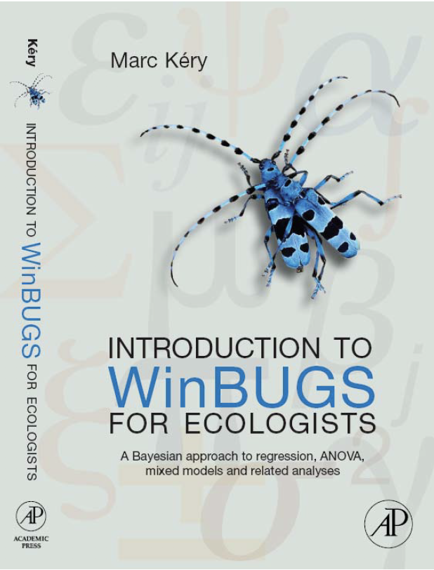
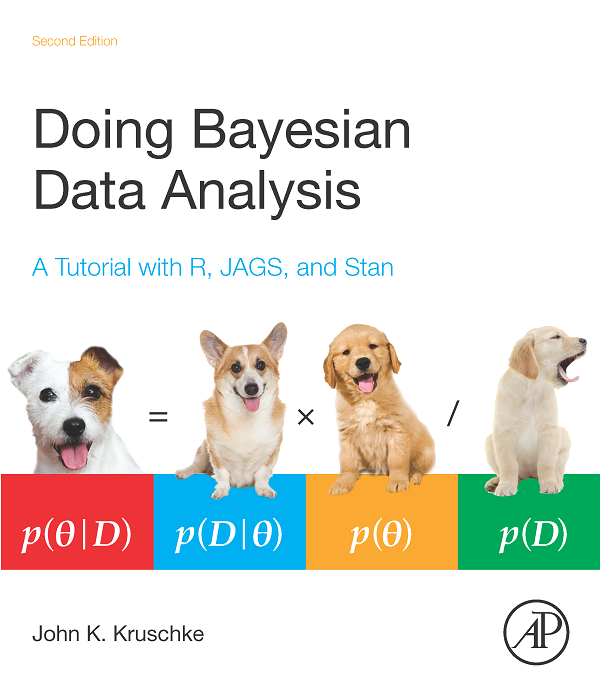
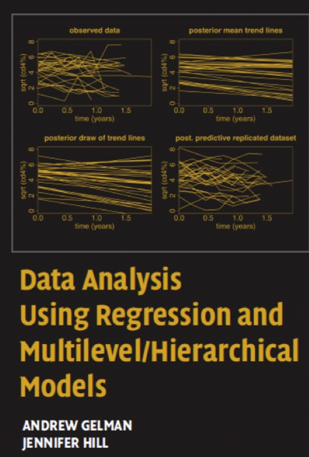
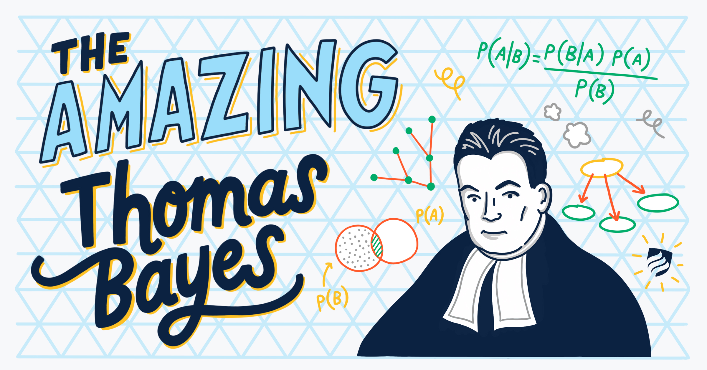
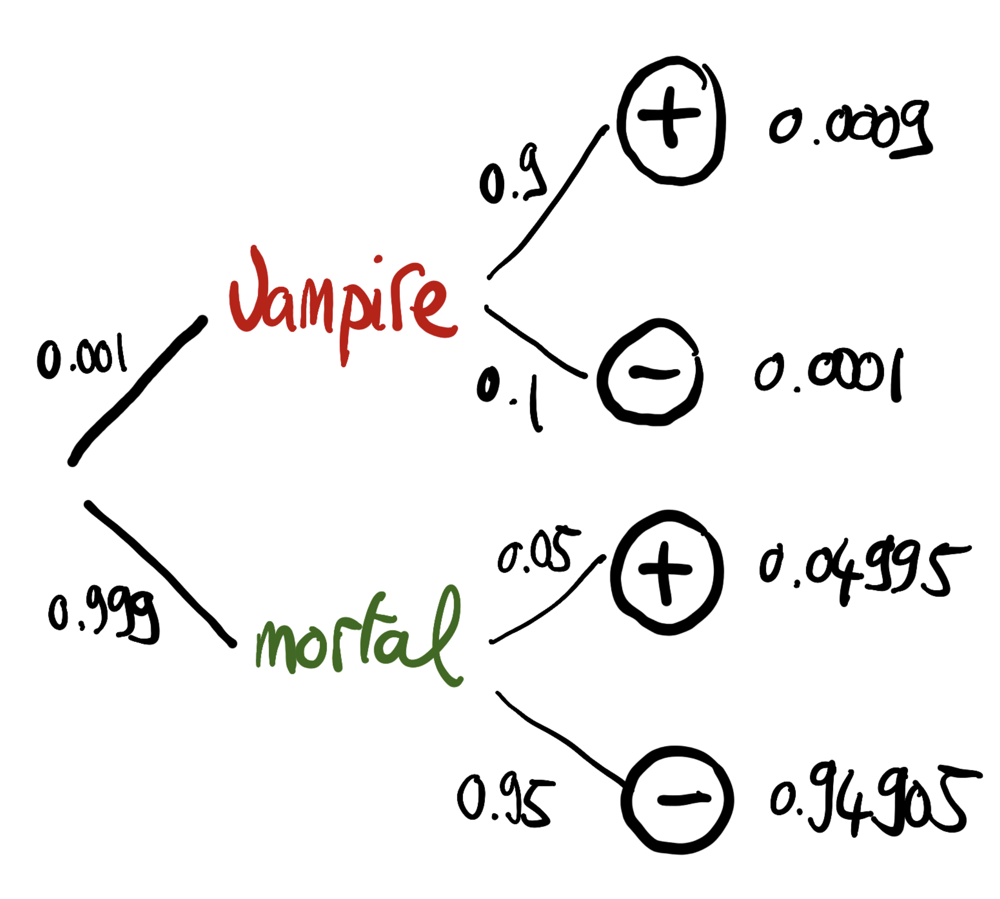

```{r setup, include = FALSE}
knitr::opts_chunk$set(cache = FALSE, 
                      echo = TRUE, 
                      message = FALSE, 
                      warning = FALSE,
                      fig.height=6, 
                      fig.width = 1.777777*6,
                      tidy = FALSE, 
                      comment = NA, 
                      highlight = TRUE, 
                      prompt = FALSE, 
                      crop = TRUE,
                      comment = "#>",
                      collapse = TRUE)
knitr::opts_knit$set(width = 60)
library(tidyverse)
library(reshape2)
theme_set(theme_light(base_size = 16))
make_latex_decorator <- function(output, otherwise) {
  function() {
      if (knitr:::is_latex_output()) output else otherwise
  }
}
insert_pause <- make_latex_decorator(". . .", "\n")
insert_slide_break <- make_latex_decorator("----", "\n")
insert_inc_bullet <- make_latex_decorator("> *", "*")
insert_html_math <- make_latex_decorator("", "$$")
```


## Credit where credit's due

* Ruth King, Byron Morgan, Steve Brooks (our workshops and [\alert{Bayesian analysis for population ecology} book](https://www.maths.ed.ac.uk/~rking33/Book-website/index.html)).

* Richard McElreath ([\alert{Statistical rethinking} book and lecture videos](https://github.com/rmcelreath/statrethinking_winter2019)).

* Jim Albert and Jingchen Hu ([\alert{Probability and Bayesian modelling} book](https://bayesball.github.io/BOOK/probability-a-measurement-of-uncertainty.html)).

* Materials shared by [\alert{Tristan Marh}](https://www.tjmahr.com/), [\alert{Jason Matthiopoulos}](https://www.gla.ac.uk/researchinstitutes/bahcm/staff/jasonmatthiopoulos/), [\alert{Francisco Rodriguez Sanchez}](https://frodriguezsanchez.net/), [\alert{Kerrie Mengersen}](https://staff.qut.edu.au/staff/k.mengersen) and [\alert{Mark Lai}](https://quantscience.rbind.io/).

## Slides, code and data

* All material prepared with `R`.
* `R Markdown` used to write reproducible material.
* Dedicated website [\alert{https://oliviergimenez.github.io/bayesian-stats-with-R/}](https://oliviergimenez.github.io/bayesian-stats-with-R/).

## Objectives

* Try and demystify Bayesian statistics, and what we call MCMC.
* Make the difference between Bayesian and Frequentist analyses.
* Understand the Methods section of ecological papers doing Bayesian stuff.
* Run Bayesian analyses, safely hopefully.

`r insert_slide_break()`

```{r, out.width = '13cm',out.height='7cm',fig.align='center',echo=FALSE}
knitr::include_graphics('img/brace_yourself.jpeg')
```

## What is on our plate?

1. An introduction to Bayesian inference
2. The likelihood
3. Bayesian analyses by hand
4. A detour to explore priors
5. Markov chains Monte Carlo methods (MCMC)
6. Bayesian analyses in `R` with the `Jags` software
7. Contrast scientific hypotheses with model selection
8. Heterogeneity and multilevel models (aka mixed models)

# I want moooooore

`r insert_slide_break()`

```{r, out.width = '13cm',out.height='7cm',fig.align='center',echo=FALSE}

```

`r insert_slide_break()`

```{r, fig.align = 'center', echo = FALSE}

```

`r insert_slide_break()`

```{r, fig.align = 'center', echo = FALSE}

```

`r insert_slide_break()`

```{r, fig.align = 'center', echo = FALSE}

```

`r insert_slide_break()`

```{r, fig.align = 'center', echo = FALSE}
knitr::include_graphics('img/mcelreath.png')
```

`r insert_slide_break()`

```{r, fig.align = 'center', echo = FALSE}

```

`r insert_slide_break()`

```{r, fig.align = 'center', echo = FALSE, out.width = '13cm', out.height='7cm'}
knitr::include_graphics('img/bda_cover.png')
```

Free at <http://www.stat.columbia.edu/~gelman/book/>

# What is Bayesian inference?

`r insert_slide_break()`



## A reminder on conditional probabilities

`r insert_inc_bullet()` $\Pr(A \mid B)$: Probability of A given B

`r insert_inc_bullet()` The ordering matters: $\Pr(A \mid B)$ is not the same as $\Pr(B \mid A)$.

`r insert_inc_bullet()` $\Pr(A \mid B) = \displaystyle{\frac{\Pr(A \text{ and } B)}{\Pr(B)}}$

`r insert_slide_break()`


## Screening for vampirism

`r insert_inc_bullet()` The chance of the  test being positive given you are a vampire is $\Pr(+|\text{vampire}) = 0.90$ (**sensitivity**).

`r insert_inc_bullet()` The chance of a negative test given you are mortal is $\Pr(-|\text{mortal}) = 0.95$ (**specificity**).


## What is the question?

`r insert_inc_bullet()` From the perspective of the test: Given a person is a vampire, what is the probability that the test is positive? $\Pr(+|\text{vampire}) = 0.90$.

`r insert_inc_bullet()` From the perspective of a person: Given that the test is positive, what is the probability that this person is a vampire? $\Pr(\text{vampire}|+) = \; ?$

`r insert_inc_bullet()` Assume that vampires are rare, and represent only $0.1\%$ of the population. This means that $\Pr(\text{vampire}) = 0.001$.

## What is the answer? Bayes' theorem to the rescue!

\begincols
\begincol



\endcol

\begincol

- $\Pr(\text{vampire}|+) = \displaystyle{\frac{\Pr(\text{vampire and } +)}{\Pr(+)}}$

`r insert_pause()`

- $\Pr(\text{vampire and } +) = \Pr(\text{vampire}) \; \Pr(+ | \text{vampire}) = 0.0009$

`r insert_pause()`

- $\Pr(+) = 0.0009 + 0.04995 = 0.05085$

`r insert_pause()`

- $\Pr(\text{vampire}|+) = 0.0009/0.05085 = 0.02$

\endcol
\endcols

`r insert_pause()`

$$\Pr(\text{vampire}|+)= \displaystyle{\frac{ \Pr(+|\text{vampire}) \; \Pr(\text{vampire})}{\Pr(+)}}$$

# Your turn: Practical 1

## Bayes' theorem

\begincols
\begincol

* A theorem about conditional probabilities.

* $\Pr(B \mid A) = \displaystyle{\frac{ \Pr(A \mid B) \; \Pr(B)}{\Pr(A)}}$

\endcol

\begincol


\endcol
\endcols

## Bayes' theorem

`r insert_inc_bullet()` Easy to mess up with letters. Might be easier to remember when written like this:

$$ \Pr(\text{hypothesis} \mid \text{data}) = \frac{ \Pr(\text{data} \mid \text{hypothesis}) \; \Pr(\text{hypothesis})}{\Pr(\text{data})} $$

`r insert_inc_bullet()` The "hypothesis" is typically something unobserved or unknown. It's what you want to learn about using the data. 

`r insert_inc_bullet()` For regression models, the "hypothesis" is a parameter (intercept, slopes or error terms).

`r insert_inc_bullet()` Bayes theorem tells you the probability of the hypothesis given the data.


## What is doing science after all?

How plausible is some hypothesis given the data?

$$ \Pr(\text{hypothesis} \mid \text{data}) = \frac{ \Pr(\text{data} \mid \text{hypothesis}) \; \Pr(\text{hypothesis})}{\Pr(\text{data})} $$

## Why is Bayesian statistics not the default?

`r insert_inc_bullet()` Due to practical problems of implementing the Bayesian approach, and some wars of male statisticians's egos, little advance was made for over two centuries.

`r insert_inc_bullet()` Recent advances in computational power coupled with the development of new methodology have led to a great increase in the application of Bayesian methods within the last two decades.


## Frequentist versus Bayesian	

`r insert_inc_bullet()` Typical stats problems involve estimating parameter $\theta$ with available data.

`r insert_inc_bullet()` The frequentist approach (**maximum likelihood estimation** – MLE) assumes that the parameters are fixed, but have unknown values to be estimated.

`r insert_inc_bullet()` Classical estimates generally provide a point estimate of the parameter of interest.

`r insert_inc_bullet()` The Bayesian approach assumes that the parameters are not fixed but have some fixed  unknown distribution - a distribution for the parameter.


## What is the Bayesian approach?	

* The approach is based upon the idea that the experimenter begins with some prior beliefs about the system.

`r insert_pause()`

* And then updates these beliefs on the basis of observed data.

`r insert_pause()`

* This updating procedure is based upon the Bayes’ Theorem:

$$\Pr(A \mid B) = \frac{\Pr(B \mid A) \; \Pr(A)}{\Pr(B)}$$

## What is the Bayesian approach?	

* Schematically if $A = \theta$ and $B = \text{data}$, then

`r insert_pause()`

* The Bayes' theorem

$$\Pr(A \mid B) = \frac{\Pr(B \mid A) \; \Pr(A)}{\Pr(B)}$$

`r insert_pause()`

* Translates into:

$$\Pr(\theta \mid \text{data}) = \frac{\Pr(\text{data} \mid \theta) \; \Pr(\theta)}{\Pr(\text{data})}$$

## Bayes' theorem	

$${\color{red}{\Pr(\theta \mid \text{data})}} = \frac{\color{blue}{\Pr(\text{data} \mid \theta)} \; \color{green}{\Pr(\theta)}}{\color{orange}{\Pr(\text{data})}}$$

`r insert_pause()`

* \textcolor{red}{Posterior distribution}: Represents what you know after having seen the data. The basis for inference, a distribution, possibly multivariate if more than one parameter ($\theta$). 

`r insert_pause()`

* \textcolor{blue}{Likelihood}: We know that quantity, same as in the MLE approach.

`r insert_pause()`

* \textcolor{green}{Prior distribution}: Represents what you know before seeing the data. The source of much discussion about the Bayesian approach.

`r insert_pause()`

* $\color{orange}{\Pr(\text{data}) = \int \Pr(\text{data} \mid \theta) \;\Pr(\theta) d\theta }$: Possibly high-dimensional integral, difficult if not impossible to calculate. This is one of the reasons why we need simulation (MCMC) methods - more soon.

`r insert_slide_break()`

```{r, echo=FALSE, fig.align='center'}
# knitr::include_graphics('img/frequentists_vs_bayesians_2x.png')
knitr::include_graphics('img/bayes_theorem.png')
```


