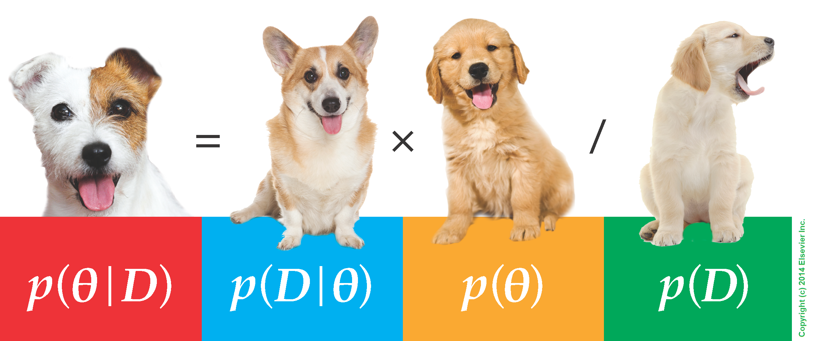

```{r setup, include = FALSE}
knitr::opts_chunk$set(cache = FALSE, 
                      echo = TRUE, 
                      message = FALSE, 
                      warning = FALSE,
                      fig.height=6, 
                      fig.width = 1.777777*6,
                      tidy = FALSE, 
                      comment = NA, 
                      highlight = TRUE, 
                      prompt = FALSE, 
                      crop = TRUE,
                      comment = "#>",
                      collapse = TRUE)
knitr::opts_knit$set(width = 60)
library(tidyverse)
library(reshape2)
theme_set(theme_light(base_size = 16))
make_latex_decorator <- function(output, otherwise) {
  function() {
      if (knitr:::is_latex_output()) output else otherwise
  }
}
insert_pause <- make_latex_decorator(". . .", "\n")
insert_slide_break <- make_latex_decorator("----", "\n")
insert_inc_bullet <- make_latex_decorator("> *", "*")
insert_html_math <- make_latex_decorator("", "$$")
```


# Back to Bayes

## A simple example
* Let us take a simple example to fix ideas.
* 120 deer were radio-tracked over winter.
* 61 close to a plant, 59 far from any human activity.
* Question: is there a treatment effect on survival?

|            | Released   | Alive | Dead | Other |
|------------+----------+-------+------+-------| 
| treatment  | 61 | 19 | 38 | 4 |
| control    | 59 | 21 | 38 | 0 |


`r insert_slide_break()`

`r insert_inc_bullet()` So, $n = 57$ deer were assigned to the treatment group of which $k=19$ survived the winter.

`r insert_inc_bullet()` Of interest is the probability of over-winter survival, call it $\theta$, for the general population within the treatment area.

`r insert_inc_bullet()` The obvious estimate is simply to take the ratio $k/n=19/57$.


`r insert_inc_bullet()` How would the classical statistician justify this estimate?

`r insert_slide_break()`

* Our model is that we have a Binomial experiment (assuming independent and identically distributed draws from the population).

`r insert_pause()`

* $K$ the number of alive individuals at the end of the winter, so that $P(K=k) = \binom{n}{k}\theta^k(1-\theta)^{n-k}$.

`r insert_pause()`

* The classical approach is to maximise the corresponding likelihood with respect to $\theta$ to obtain the entirely plausible MLE:

$$ \hat{\theta} = k/n = 19/57$$.

## The Bayesian approach

`r insert_inc_bullet()` The Bayesian starts off with a prior.

`r insert_inc_bullet()` Now, the one thing we know about $\theta$ is that is a continuous random variable and that it lies between zero and one.

`r insert_inc_bullet()` Thus, a suitable prior distribution might be the Beta defined on $[0,1]$.

`r insert_inc_bullet()` What is the Beta distribution?

## What is the Beta distribution?

$$
q(\theta \mid \alpha, \beta) = \frac{1}{\text{Beta}(\alpha, \beta)}{\theta^{\alpha - 1}} {(1-\theta)^{\beta - 1}} 
$$

with $\text{Beta}(\alpha, \beta) = \displaystyle{\frac{\Gamma(\alpha)\Gamma(\beta)}{\Gamma(\alpha+\beta)}}$ and $\Gamma(n) = (n-1)!$

`r insert_slide_break()`

```{r, echo=FALSE} 
x <- seq(0, 1, length=200)
par(mfrow = c(2,3))
# distribution a posteriori beta
plot(x,dbeta(x, 1, 1),type='l',xlab='q',ylab='Density',main='beta(1,1)',lwd=3,col='red',ylim=c(0,1.5))
plot(x,dbeta(x, 2, 1),type='l',xlab='q',ylab='',main='beta(2,1)',lwd=3,col='red',ylim=c(0,2))
plot(x,dbeta(x, 1, 2),type='l',xlab='q',ylab='',main='beta(1,2)',lwd=3,col='red',ylim=c(0,2))
plot(x,dbeta(x, 2, 2),type='l',xlab='q',ylab='Density',main='beta(2,2)',lwd=3,col='red',ylim=c(0,1.5))
plot(x,dbeta(x, 10, 10),type='l',xlab='q',ylab='',main='beta(10,10)',lwd=3,col='red',ylim=c(0,3.5))
plot(x,dbeta(x, 0.8, 0.8),type='l',xlab='q',ylab='',main='beta(0.8,0.8)',lwd=3,col='red',ylim=c(0.5,2.5))
```

## The Bayesian approach

* We assume a priori that $\theta \sim Beta(a,b)$ so that $\Pr(\theta) = \theta^{a-1} (1 - \theta)^{b-1}$

`r insert_pause()`

* Then we have:

$$
\begin{aligned}
{\color{red}{Pr(\theta \mid k)}} & \propto {\color{blue}{\binom{n}{k}\theta^k(1-\theta)^{n-k}}} \; {\color{green}{\theta^{a-1} (1 - \theta)^{b-1}}}\\
& \propto {\theta^{(a+k)-1}} {(1-\theta)^{(b+n-k)-1}} 
\end{aligned}
$$

`r insert_pause()`

* That is: 

$$ \theta \mid k \sim Beta(a+k,b+n-k)$$

`r insert_pause()`

* Take a Beta prior with a Binomial likelihood, you get a Beta posterior (conjugacy)

## Application to the deer example

`r insert_inc_bullet()` Posterior distribution of survival is $\theta \sim Beta(a+k,b+n-k)$.

`r insert_inc_bullet()` If we take a Uniform prior, i.e. $Beta(1,1)$, then we have: 

`r insert_inc_bullet()` $\theta_{treatment} \sim Beta(1+19,1+57-19)=Beta(20,39)$

`r insert_inc_bullet()` Note that in this specific situation, the posterior has an explicit expression, easy to manipulate.

`r insert_inc_bullet()` In particular, $E(Beta(a,b)) = \displaystyle{\frac{a}{a+b}} = 20/59$ to be compared with the MLE $19/57$.

## A general result

**This is a general result, the Bayesian and frequentist estimates will always agree if there is sufficient data, so long as the likelihood is not explicitly ruled out by the prior.**

## Prior $Beta(1,1)$ and posterior survival $Beta(20,39)$
```{r echo=FALSE}
x <- seq(0, 1, length=200)
# distribution a posteriori beta
plot(x,dbeta(x, 20,39),type='l',xlab='',ylab='',main='',lwd=3,col='red')
# distribution a priori uniforme
points(x,dbeta(x, 1, 1),type='l',lwd=3)
```

## Prior $Beta(1,1)$ and posterior survival $Beta(20,39)$
```{r echo=FALSE}
x <- seq(0, 1, length=200)
# distribution a posteriori beta
plot(x,dbeta(x, 20,39),type='l',xlab='',ylab='',main='',lwd=3,col='red')
# distribution a priori uniforme
points(x,dbeta(x, 1, 1),type='l',lwd=3)
abline(v = 19/57, lwd = 3, lty = 2, col = 'blue')
text(x = 0.28, y = 0, 'MLE', col = 'blue')
```

## Notation

Our model so far
`r insert_html_math()`
\begin{align*}
   y &\sim \text{Binomial}(N, \theta) &\text{[likelihood]}
   \\
  \theta &\sim \text{Beta}(1, 1) &\text{[prior for }\theta \text{]} \\ 
\end{align*}
`r insert_html_math()`

`r insert_slide_break()`



