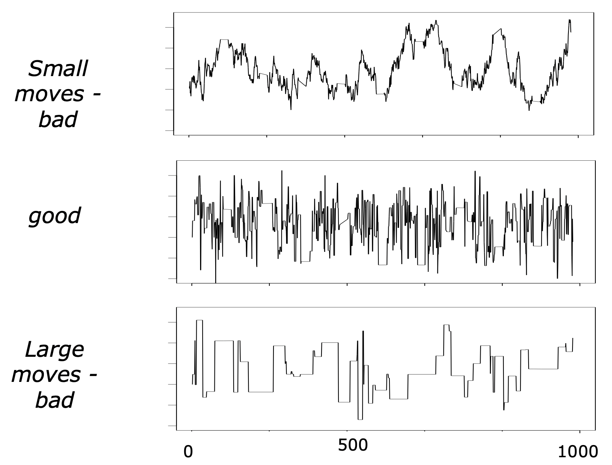
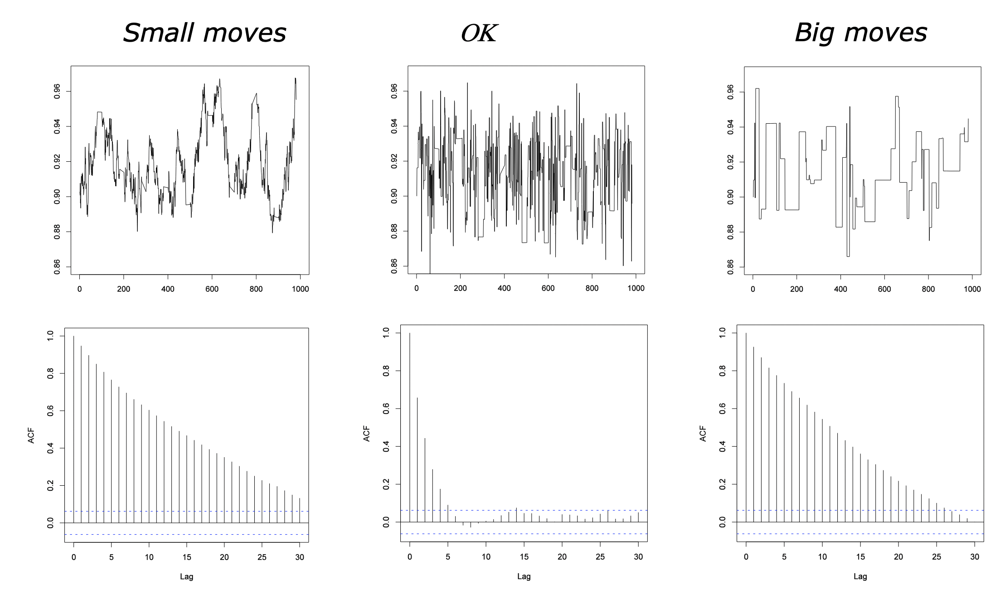
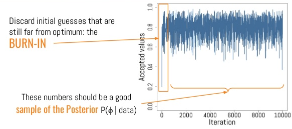

```{r setup, include = FALSE}
knitr::opts_chunk$set(cache = FALSE, 
                      echo = TRUE, 
                      message = FALSE, 
                      warning = FALSE,
                      fig.height=6, 
                      fig.width = 1.777777*6,
                      tidy = FALSE, 
                      comment = NA, 
                      highlight = TRUE, 
                      prompt = FALSE, 
                      crop = TRUE,
                      comment = "#>",
                      collapse = TRUE)
knitr::opts_knit$set(width = 60)
library(tidyverse)
library(reshape2)
theme_set(theme_light(base_size = 16))
make_latex_decorator <- function(output, otherwise) {
  function() {
      if (knitr:::is_latex_output()) output else otherwise
  }
}
insert_pause <- make_latex_decorator(". . .", "\n")
insert_slide_break <- make_latex_decorator("----", "\n")
insert_inc_bullet <- make_latex_decorator("> *", "*")
insert_html_math <- make_latex_decorator("", "$$")
```


# Bayes in practice

## Software implementation (`R` friendly)

Oldies but goodies:

* WinBUGS, OpenBUGS: Where it all began.
* Jags: What we will use in this course. 

`r insert_pause()`

The new kids on the block:

* [Nimble](https://r-nimble.org/): What I'm going for these days.
* [Stan](https://mc-stan.org/): Entirely different algorithmic approach. 
* [Greta](https://greta-stats.org/): Dunno anything about it. 

`r insert_pause()`

If you're not into coding:

* [brms](https://paul-buerkner.github.io/brms/): Bayesian regression models with Stan.
* [MCMCglmm](https://cran.r-project.org/web/packages/MCMCglmm/index.html): Generalised Linear Mixed Models.
* Check out the [CRAN Task View: Bayesian Inference](https://cran.r-project.org/web/views/Bayesian.html) for more.

## Introduction to JAGS (Just Another Gibbs Sampler)

\begin{center}
Martyn Plummer
\end{center}
```{r, out.width = '9cm',out.height='5cm',fig.align='center',echo=FALSE}
 
```

## Real example

Impact of climatic conditions on white stork breeding success

```{r, out.width = '10cm',out.height='8cm',fig.align='center',echo=FALSE}
    
```

## Let's do a logistic regression on some White stork data

`r insert_inc_bullet()` Assess effects of temperature and rainfall on productivity.

`r insert_inc_bullet()` We have collected data.

`r insert_inc_bullet()` We need to build a model - write down the likelihood.

`r insert_inc_bullet()` We need to specify priors for parameters.

## Read in the data
```{r}
nbchicks <- c(151,105,73,107,113,87,77,108,118,122,112,120,122,89,69,71,
              53,41,53,31,35,14,18)

nbpairs <- c(173,164,103,113,122,112,98,121,132,136,133,137,145,117,
             90,80,67,54,58,39,42,23,23)

temp <- c(15.1,13.3,15.3,13.3,14.6,15.6,13.1,13.1,15.0,11.7,15.3,14.4,
          14.4,12.7,11.7,11.9,15.9,13.4,14.0,13.9,12.9,15.1,13.0)

rain <- c(67,52,88,61,32,36,72,43,92,32,86,28,57,55,66,26,28,96,48,90,86,
           78,87)
```

`r insert_slide_break()`

```{r}
datax <- list(N = 23, 
              nbchicks = nbchicks, 
              nbpairs = nbpairs, 
              temp = (temp - mean(temp))/sd(temp), 
              rain = (rain - mean(rain))/sd(rain))
```

## Write down the model

`r insert_html_math()`
\begin{align*}
   \text{nbchicks}_i &\sim \text{Binomial(nbpairs}_i,p_i) &\text{[likelihood]}
   \\
  \text{logit}(p_i) &= a + b_{temp} \; \text{temp}_{i} + b_{rain} \; \text{rain}_{i} &\text{[linear model]} \\
  a &\sim \text{Normal}(0, 1000) &\text{[prior for }a] \\ 
  b_{temp} &\sim \text{Normal}(0, 1000) &\text{[prior for }b_{temp}] \\ 
  b_{rain} &\sim \text{Normal}(0, 1000) &\text{[prior for }b_{rain}] \\ 
\end{align*}
`r insert_html_math()`

## Build the model

```{r, echo=TRUE, eval=FALSE}
{
# Likelihood
  	for( i in 1 : N){
		nbchicks[i] ~ dbin(p[i],nbpairs[i])
		logit(p[i]) <- a + b.temp * temp[i] + b.rain * rain[i]
		}
# ...
```

## Specify priors 
```{r, echo=TRUE, eval=FALSE}
# Priors
a ~ dnorm(0,0.001)
b.temp ~ dnorm(0,0.001)
b.rain ~ dnorm(0,0.001)
}
```
**Warning**: Jags uses precision for Normal distributions (1 / variance)

## You need to write everything in a file

```{r message=FALSE, warning=FALSE}
model <- 
paste("
model
{
	for( i in 1 : N) 
		{
		nbchicks[i] ~ dbin(p[i],nbpairs[i])
		logit(p[i]) <- a + b.temp * temp[i] + b.rain * rain[i]
		}
a ~ dnorm(0,0.001)
b.temp ~ dnorm(0,0.001)
b.rain ~ dnorm(0,0.001)
	}
")
writeLines(model,"code/logistic.txt")
```

## Alternatively, you may write a `R` function

```{r, message=FALSE, warning=FALSE, eval = FALSE}
logistic <- function() {
	for( i in 1 : N) 
		{
		nbchicks[i] ~ dbin(p[i],nbpairs[i])
		logit(p[i]) <- a + b.temp * temp[i] + b.rain * rain[i]
		}
			
# priors for regression parameters
a ~ dnorm(0,0.001)
b.temp ~ dnorm(0,0.001)
b.rain ~ dnorm(0,0.001)
	}
```


## Let us specify a few additional things

```{r message=FALSE, warning=FALSE}
# list of lists of initial values (one for each MCMC chain)
init1 <- list(a = -0.5, b.temp = -0.5, b.rain = -0.5)
init2 <- list(a = 0.5, b.temp = 0.5, b.rain = 0.5)
inits <- list(init1,init2)

# specify parameters that need to be estimated
parameters <- c("a","b.temp","b.rain")

# specify nb iterations for burn-in and final inference 
nb.burnin <- 10000
nb.iterations <- 20000 # beware: nb.iterations includes nb.burnin!
```

## Run Jags

```{r eval = FALSE}
# load R2jags
library(R2jags)
# run Jags
storks <- jags(data  = datax,
               inits = inits,
               parameters.to.save = parameters,
               #model.file = "code/logistic.txt",
               model.file = logistic, # if a function was written
               n.chains = 2,
               n.iter = nb.iterations,
               n.burnin = nb.burnin)
storks
```

## Inspect parameter estimates

\footnotesize

```{r echo=FALSE, message=FALSE, warning=FALSE}
library(R2jags)
storks <- jags(data  = datax,
               inits = inits,
               parameters.to.save = parameters,
               model.file = "code/logistic.txt",
               n.chains = 2,
               n.iter = nb.iterations,
               n.burnin = nb.burnin,
               n.thin = 1)
storks
```

\normalsize

# Your turn: Practical 5

# Assess convergence

## Reminder – MCMC Algorithm

`r insert_inc_bullet()` MCMC algorithms can be used to construct a Markov chain with a given stationary distribution (set to be the posterior distribution).

`r insert_inc_bullet()` For the MCMC algorithm, the posterior distribution is only needed to be known up to proportionality. 

`r insert_inc_bullet()` Once the stationary distribution is reached we can regard the realisations of the chain as a (dependent) sample from the posterior distribution (and obtain Monte Carlo estimates).

`r insert_inc_bullet()` We consider some important implementation issues.

## MCMC – Proposal Distribution

* To implement a MCMC algorithm, we often need to specify a proposal distribution from which we generate candidate value then accept/reject.

`r insert_pause()`

* This typically involves
    * specifying a given distribution family (e.g. normal, uniform), and then, 
    * setting the parameters of the given distribution.

`r insert_pause()`

* Although the exact distribution specified is essentially arbitrary – it will have a significant effect on the performance of the MCMC algorithm.

## Why is the proposal distribution so important?

`r insert_inc_bullet()` If only small moves can be proposed, the acceptance probability is high, but it will take a long time to explore the posterior distribution.

`r insert_inc_bullet()` Proposing large jumps has the potential to move further, but generally have smaller acceptance probabilities.

`r insert_inc_bullet()` In order to balance the size of the proposed moves with the chance of accepting them the proposal variance is often tuned to obtain a mean acceptance probability of $20-40\%$. 

`r insert_inc_bullet()` Automatic in Jags – ouf!

`r insert_inc_bullet()` The movement around the parameter space is often referred to as **mixing**.

## Good/Bad Traces



## Autocorrelation functions

`r insert_inc_bullet()` Traceplots of for small and big moves provide (relatively) high correlations (known as autocorrelations) between successive observations of the Markov chain.

`r insert_inc_bullet()` Strongly correlated observations require large sample sizes and therefore longer simulations.

`r insert_inc_bullet()` Autocorrelation function (ACF) plots are a convenient way of displaying the strength of autocorrelation in the given sample values.

`r insert_inc_bullet()` ACF plots provide the autocorrelation between successively sampled values separated by $k$ iterations, referred to as lag, (i.e. $\text{cor}(\theta_t, \theta_{t+k})$) for increasing values of $k$.

## ACFs

```{r, echo=FALSE}
   
```

## Traceplots for the storks

\footnotesize

```{r message=FALSE, warning=FALSE}
traceplot(storks,mfrow = c(1, 2), varname = c('b.rain','b.temp'), ask = FALSE)
```

\normalsize

## Autocorrelation for the storks

\footnotesize

```{r message=FALSE, warning=FALSE}
autocorr.plot(as.mcmc(storks),ask = FALSE) 
```

\normalsize

## How do good chains behave? 

`r insert_inc_bullet()` Converge to same target distribution: We need to think of the time required for convergence (realisations of the Markov chain have to be discarded before this is achieved).

`r insert_inc_bullet()` Once there, explore efficiently: The post-convergence sample size required for suitable numerical summaries.

## Convergence assessment

`r insert_inc_bullet()` Here, we are looking to determine how long it takes for the Markov chain to converge to the stationary distribution.

`r insert_inc_bullet()` In practice, we must discard observations from the start of the chain and just use observations from the chain once it has converged.

`r insert_inc_bullet()` The initial observations that we discard are referred to as the **burn-in**.

`r insert_inc_bullet()` The simplest method to determine the length of the burn-in period is to look at trace plots.

## Burn-in (if simulations cheap, be conservative)

```{r, out.width = '11cm',out.height='7cm',fig.align='center',echo=FALSE}
   
```

## Effective sample size `n.eff`

* How long of a chain is needed to produce stable estimates ?

`r insert_pause()`

* Most MCMC chains are strongly autocorrelated.

`r insert_pause()`

* Successive steps are near each other, and are not independent. 

`r insert_pause()`

* The effective sample size (`n.eff`) measures chain length while taking into account the autocorrelation of the chain.
    * `n.eff` is less than the number of MCMC iterations.
    * Check the `n.eff` of every parameter of interest.
    * Check the `n.eff` of any interesting parameter combinations.

`r insert_pause()`

* We need $\text{n.eff} \geq 100$ independent steps. 

## Potential scale reduction factor

`r insert_inc_bullet()` Gelman-Rubin statistic $\hat{R}$

`r insert_inc_bullet()` Measures the ratio of the total variability combining multiple chains (between-chain plus within-chain) to the within-chain variability. Asks the question is there a chain effect? Very much alike the $F$ test in an ANOVA. 

`r insert_inc_bullet()` Values near $1$ indicates likely convergence, a value of $\leq 1.1$ is considered acceptable.

`r insert_inc_bullet()` Necessary condition, not sufficient; In other words, these diagnostics cannot tell you that you have converged for sure, only that you have not. 

## `n.eff` and $\hat{R}$ for the storks

\footnotesize

```{r}
storks
```

\normalsize

## To sum up

`r insert_inc_bullet()` Run multiple chains from arbitrary starting places (initial values).

`r insert_inc_bullet()` Assume convergence when all chains reach same regime.

`r insert_inc_bullet()` Discard initial burn-in phase.

`r insert_inc_bullet()` Check autocorrelation, effective sample size and $\hat{R}$.


## What if you have issues of convergence?

* Increase burn-in, sample more.

`r insert_pause()`

*	Use more informative priors.

* Pick better initial values (good guess).

`r insert_pause()`

* Reparameterize: 
     + Standardize covariates.
     + Non-centering: $\alpha \sim N(0,\sigma)$ becomes $\alpha = z \sigma$ with $z \sim N(0,1)$.

`r insert_pause()`

*	Something wrong with your model? 
     + Start with a simpler model (remove complexities). 
     + Use simulations. 

`r insert_pause()`

* Change your sampler. Upgrade to Nimble or Stan.


# MCMC makes you queens and kings of the stats world

## Get all values sampled from posteriors

\footnotesize

```{r message=FALSE, warning=FALSE}
res <- as.mcmc(storks) # convert outputs in a list
res <- rbind(res[[1]],res[[2]]) # put two MCMC lists on top of each other
head(res)
```

`r insert_slide_break()`

```{r message=FALSE, warning=FALSE}
tail(res)
```

\normalsize

## Compute a posteriori Pr(rain < 0)
```{r message=FALSE, warning=FALSE}
# probability that the effect of rainfall is negative
mean(res[,'b.rain'] < 0)
```

## Compute a posteriori Pr(temp < 0)
```{r message=FALSE, warning=FALSE}
# probability that the effect of temperature is negative
mean(res[,'b.temp'] < 0)
```

## Get credible interval for the rain effect
```{r message=FALSE, warning=FALSE}
quantile(res[,'b.rain'],c(0.025,0.975))
```

## Get credible interval for the temperature effect
```{r message=FALSE, warning=FALSE}
quantile(res[,'b.temp'],c(0.025,0.975))
```

## Graphical summaries
```{r echo=FALSE, message=FALSE, warning=FALSE}
par(mfrow=c(1,2))
plot(density(res[,'b.rain']),xlab="",ylab="", main="Rainfall",lwd=3)
abline(v=0,col='red',lwd=2)
plot(density(res[,'b.temp']),xlab="",ylab="", main="Temperature",lwd=3)
abline(v=0,col='red',lwd=2)
```

# Your turn: Practical 6

