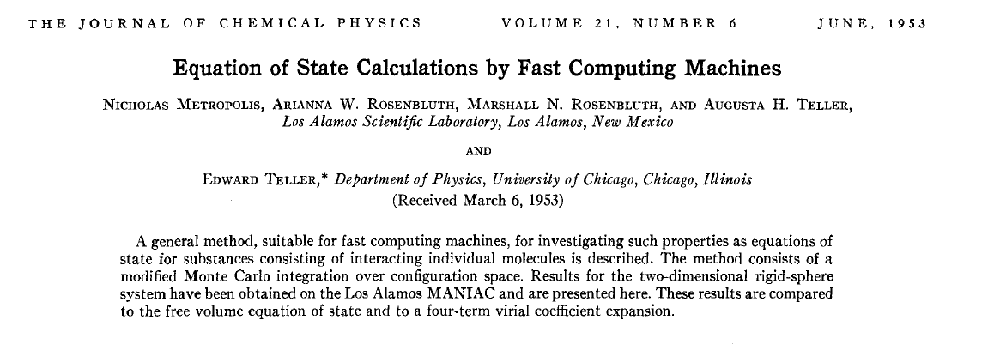

```{r setup, include = FALSE}
knitr::opts_chunk$set(cache = FALSE, 
                      echo = TRUE, 
                      message = FALSE, 
                      warning = FALSE,
                      fig.height=6, 
                      fig.width = 1.777777*6,
                      tidy = FALSE, 
                      comment = NA, 
                      highlight = TRUE, 
                      prompt = FALSE, 
                      crop = TRUE,
                      comment = "#>",
                      collapse = TRUE)
knitr::opts_knit$set(width = 60)
library(tidyverse)
library(reshape2)
theme_set(theme_light(base_size = 16))
make_latex_decorator <- function(output, otherwise) {
  function() {
      if (knitr:::is_latex_output()) output else otherwise
  }
}
insert_pause <- make_latex_decorator(". . .", "\n")
insert_slide_break <- make_latex_decorator("----", "\n")
insert_inc_bullet <- make_latex_decorator("> *", "*")
insert_html_math <- make_latex_decorator("", "$$")
```


# Get posteriors with Markov chains Monte Carlo (MCMC) methods

## Back to the Bayes' theorem	

* Bayes inference is easy! Well, not so easy in real-life applications.

`r insert_pause()`

* The issue is in ${\Pr(\theta \mid \text{data})} = \displaystyle{\frac{{\Pr(\text{data} \mid \theta)} \; {\Pr(\theta)}}{\color{orange}{\Pr(\text{data})}}}$

`r insert_pause()`

* $\color{orange}{\Pr(\text{data}) = \int{L(\text{data} \mid \theta)\Pr(\theta) d\theta}}$ is a $N$-dimensional integral if $\theta = \theta_1, \ldots, \theta_N$ 

`r insert_pause()`

* Difficult, if not impossible to calculate! 

## Brute force approach via numerical integration

* Deer data
```{r}
y <- 19 # nb of success
n <- 57 # nb of attempts
```

* Likelihood $\text{Binomial}(57, \theta)$

* Prior $\text{Beta}(a = 1, b = 1)$

## Beta prior

```{r}
a <- 1; b <- 1; p <- seq(0,1,.002)
plot(p, dbeta(p,a,b), type='l', lwd=3)
```

## Apply Bayes theorem

* Likelihood times the prior: $\Pr(\text{data} \mid \theta) \; \Pr(\theta)$
```{r}
numerator <- function(p) dbinom(y,n,p)*dbeta(p,a,b)
```

* Averaged likelihood: $\Pr(\text{data}) = \int{L(\theta \mid \text{data}) \; \Pr(\theta) d\theta}$
```{r}
denominator <- integrate(numerator,0,1)$value
```

## Posterior inference via numerical integration

```{r}
plot(p, numerator(p)/denominator,type="l", lwd=3, col="green", lty=2)
```

## Superimpose explicit posterior distribution (Beta formula) 

```{r eval = FALSE}
lines(p, dbeta(p,y+a,n-y+b), col='darkred', lwd=3)
```

```{r echo = FALSE}
plot(p, numerator(p)/denominator,type="l", lwd=3, col="green", lty=2)
lines(p, dbeta(p,y+a,n-y+b), col='darkred', lwd=3)
```

## And the prior

```{r eval = FALSE}
lines(p, dbeta(p,a,b), col='darkblue', lwd=3)
```

```{r echo = FALSE}
plot(p, numerator(p)/denominator,type="l", lwd=3, col="green", lty=2)
lines(p, dbeta(p,y+a,n-y+b), col='darkred', lwd=3)
lines(p, dbeta(p,a,b), col='darkblue', lwd=3)
```

## What if multiple parameters, like in a simple linear regression?

* Example of a linear regression with parameters $\alpha$, $\beta$ and $\sigma$ to be estimated. 

`r insert_pause()`

* Bayes' theorem says:

$$ P(\alpha, \beta, \sigma \mid \text{data}) = \frac{ P(\text{data} \mid \alpha, \beta, \sigma) \, P(\alpha, \beta, \sigma)}{\iiint \, P(\text{data} \mid \alpha, \beta, \sigma) \, P(\alpha, \beta, \sigma) \,d\alpha \,d\beta \,d\sigma} $$

`r insert_pause()`

* Do we really wish to calculate a 3D integral?

## Bayesian computation

* In the early 1990s, statisticians rediscovered work from the 1950's in physics.

```{r, out.width = '9cm',out.height='3cm',fig.align='center',echo=FALSE}
   
```

`r insert_pause()`

* Use stochastic simulation to draw samples from posterior distributions.

`r insert_pause()`

* Avoid explicit calculation of integrals in Bayes formula.

`r insert_pause()`

* Instead, approximate posterior to arbitrary degree of precision by drawing large sample.

`r insert_pause()`

* Markov chain Monte Carlo = MCMC; boost to Bayesian statistics!

## MANIAC

```{r, out.width = '11cm',out.height='7cm',fig.align='center',echo=FALSE}
knitr::include_graphics('img/maniac.png')   
```

## Why are MCMC methods so useful?

`r insert_inc_bullet()` MCMC: stochastic algorithm to produce sequence of dependent random numbers (from Markov chain).

`r insert_inc_bullet()` Converge to equilibrium (aka stationary) distribution.

`r insert_inc_bullet()` Equilibrium distribution is the desired posterior distribution!

`r insert_inc_bullet()` Several ways of constructing these chains: e.g., Metropolis-Hastings, Gibbs sampler, Metropolis-within-Gibbs.

`r insert_inc_bullet()` How to implement them in practice?!

## The Metropolis algorithm

`r insert_inc_bullet()` We illustrate sampling from a discrete distribution. Suppose we define a discrete probability distribution on the integers $1, \ldots, K$.

`r insert_inc_bullet()` We write a short function `pd()` in `R` taking on the values $1, \ldots, 8$ with probabilities proportional to the values 5, 10, 4, 4, 20, 20, 12, and 5.

`r insert_slide_break()`

```{r}
pd <- function(x){
  values <- c(5, 10, 4, 4, 20, 20, 12, 5)
  ifelse(x %in% 1:length(values), values[x], 0)
}
prob_dist <- data.frame(x = 1:8, prob = pd(1:8))
prob_dist
```

`r insert_slide_break()`

```{r echo=FALSE}
prob_dist %>%
  ggplot(aes(x = x, y = prob)) + 
  geom_col(width = 0.3) + 
  labs(x = 'x', y = 'Probability')
```

`r insert_slide_break()`

To simulate from this probability distribution, we take a **random walk** described as follows.

`r insert_pause()`

1. We start at any possible location of our random variable from 1 to $K = 8$

`r insert_pause()`

2. To decide where to visit next, a fair coin is flipped. If the coin lands heads, we think about visiting the location one value to the left, and if coin lands tails, we consider visiting the location one value to right. We call this location the **candidate** location.

`r insert_pause()`

3. We compute the ratio of the probabilities at the candidate and current locations $R = pd(candidate)/pd(current)$

`r insert_pause()`

4. We spin a continuous spinner that lands anywhere from 0 to 1 – call the random spin $X$. If $X$ is smaller than $R$, we move to the candidate location, and otherwise we remain at the current location.

`r insert_pause()`

5. We repeat 2-4 a number of times called **steps** (many steps).

`r insert_slide_break()`

```{r}
random_walk <- function(pd, start, num_steps){
  y <- rep(0, num_steps)
  current <- start
  for (j in 1:num_steps){
    candidate <- current + sample(c(-1, 1), 1)
    prob <- pd(candidate) / pd(current)
    if (runif(1) < prob) current <- candidate
    y[j] <- current
  }
  return(y)
}
```

`r insert_slide_break()`

Starting at the value $X = 4$ and running the algorithm for $s = 10,000$ iterations.

```{r}
out <- random_walk(pd, 4, 10000)
head(out)
tail(out)
```

`r insert_slide_break()`

```{r echo = FALSE}
sim <- data.frame(out) %>% 
  group_by(out) %>% 
  summarize(N = n(), prob = N / 10000) %>%
  select(out, prob) %>%
  add_column(Type = 'Simulated')

truth <- data.frame(out = 1:8, prob = pd(1:8)/sum(pd(1:8)), Type = 'Actual')

bind_rows(sim,truth) %>%
  ggplot() +
  aes(x = out, y = prob, fill = Type) +
  geom_col(width = 0.5, position = "dodge") + 
  labs(x = 'x', y = 'Probability')
```

## Animating the Metropolis algorithm - 2D example

[\alert{https://mbjoseph.github.io/posts/2018-12-25-animating-the-metropolis-algorithm/}](https://mbjoseph.github.io/posts/2018-12-25-animating-the-metropolis-algorithm/)

## The Markov-chain Monte Carlo Interactive Gallery

[\alert{https://chi-feng.github.io/mcmc-demo/}](https://chi-feng.github.io/mcmc-demo/)

